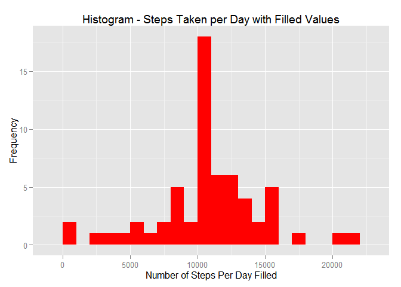
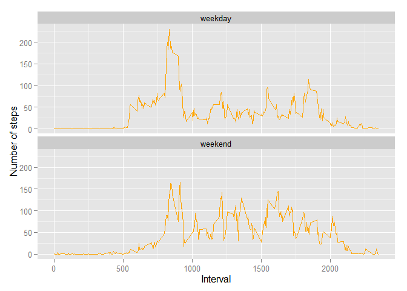

# Reproducible Research Assignment 1 - Activity Monitor Analysis

##Introduction

It is now possible to collect a large amount of data about personal movement using activity monitoring devices such as a Fitbit, Nike Fuelband, or Jawbone Up. These type of devices are part of the "quantified self" movement - a group of enthusiasts who take measurements about themselves regularly to improve their health, to find patterns in their behavior, or because they are tech geeks. But these data remain under-utilized both because the raw data are hard to obtain and there is a lack of statistical methods and software for processing and interpreting the data.

This analysis makes use of data from a personal activity monitoring device. This device collects data at 5 minute intervals through out the day. The data consists of two months of data from an anonymous individual collected during the months of October and November, 2012 and include the number of steps taken in 5 minute intervals each day.

##Data

The data for this assignment can be downloaded from the course web site:

    [Dataset: Activity monitoring data] (https://d396qusza40orc.cloudfront.net/repdata%2Fdata%2Factivity.zip)
    

The variables included in this dataset are:

    - steps: Number of steps taking in a 5-minute interval (missing values are coded as NA)

    - date: The date on which the measurement was taken in YYYY-MM-DD format

    - interval: Identifier for the 5-minute interval in which measurement was taken

The dataset is stored in a comma-separated-value (CSV) file and there are a total of 17,568 observations in this dataset.

#### This analysis requires the dplyr, ggplot2, and lubridate packages


```r
library(dplyr)
```

```
## 
## Attaching package: 'dplyr'
## 
## The following object is masked from 'package:stats':
## 
##     filter
## 
## The following objects are masked from 'package:base':
## 
##     intersect, setdiff, setequal, union
```

```r
library(ggplot2)
library(lubridate)
```

##Loading and preprocessing the data

Show any code that is needed to:

    1. Load the data set for this analysis.  
       Nots.  The activity data will be downloaded to your current working directory
       
    2. Process/transform the data (if necessary) into a format suitable for your analysis

    

```r
url <- "http://d396qusza40orc.cloudfront.net/repdata%2Fdata%2Factivity.zip"

download.file <- "activity.zip"

if ( ! file.exists(download.file)) {
    download.file(url, download.file, mode="wb")
    unzip(download.file)
}

activity.data <- read.csv("activity.csv", colClasses = c("numeric", "Date", "numeric")) 
```
    

  Let's take a look at the activity data set:


```r
summary(activity.data)
```

```
##      steps             date               interval     
##  Min.   :  0.00   Min.   :2012-10-01   Min.   :   0.0  
##  1st Qu.:  0.00   1st Qu.:2012-10-16   1st Qu.: 588.8  
##  Median :  0.00   Median :2012-10-31   Median :1177.5  
##  Mean   : 37.38   Mean   :2012-10-31   Mean   :1177.5  
##  3rd Qu.: 12.00   3rd Qu.:2012-11-15   3rd Qu.:1766.2  
##  Max.   :806.00   Max.   :2012-11-30   Max.   :2355.0  
##  NA's   :2304
```

```r
str(activity.data)
```

```
## 'data.frame':	17568 obs. of  3 variables:
##  $ steps   : num  NA NA NA NA NA NA NA NA NA NA ...
##  $ date    : Date, format: "2012-10-01" "2012-10-01" ...
##  $ interval: num  0 5 10 15 20 25 30 35 40 45 ...
```

```r
head(activity.data)
```

```
##   steps       date interval
## 1    NA 2012-10-01        0
## 2    NA 2012-10-01        5
## 3    NA 2012-10-01       10
## 4    NA 2012-10-01       15
## 5    NA 2012-10-01       20
## 6    NA 2012-10-01       25
```
    
##What is mean total number of steps taken per day?

For this part of the analysis, ignore the missing values in the dataset.

    1. Calculate the total number of steps taken per day.
       
    

```r
steps.per.day <- activity.data  %>%
    group_by(date) %>%
    summarise(steps = sum(steps))

head(steps.per.day)
```

```
## Source: local data frame [6 x 2]
## 
##         date steps
## 1 2012-10-01    NA
## 2 2012-10-02   126
## 3 2012-10-03 11352
## 4 2012-10-04 12116
## 5 2012-10-05 13294
## 6 2012-10-06 15420
```

    2. Make a histogram of the total number of steps taken each day
    

```r
ggplot(steps.per.day, aes(x = steps.per.day$steps)) + 
       geom_histogram(fill = "orange", binwidth = 1000) + 
        labs(title="Histogram - Steps Taken per Day", 
             x = "Number of Steps Per Day", y = "Frequency") + theme_grey() 
```

 

    3. Calculate and report the mean and median of the total number of steps taken per day
    
      The mean of the total number of steps taken per day:
    

```r
mean(steps.per.day$steps, na.rm = TRUE)
```

```
## [1] 10766.19
```
    
     The median of the total number of steps taken per day:
     

```r
median(steps.per.day$steps, na.rm = TRUE)
```

```
## [1] 10765
```


##What is the average daily activity pattern?

    1. Make a time series plot (i.e. type = "l") of the 5-minute interval (x-axis) and the average number of steps taken, averaged across all days (y-axis)


```r
steps.per.interval <- activity.data  %>% 
                      na.omit() %>%
                      group_by(interval) %>%
                      summarise(mean_steps = mean(steps))
    

ggplot(steps.per.interval, aes(x=interval, y=mean_steps)) +   
        geom_line(color="orange", size=1) +  
        labs(title="Average Daily Activity Pattern", x="5- Minute Interval", y="Average Number of steps") +  
        theme_grey()
```

 

 
   2. Which 5-minute interval, on average across all the days in the dataset, contains the maximum number of steps?
   
   The interval containing the maximum number of steps is:
  

```r
    top_n(steps.per.interval, 1)   
```

```
## Selecting by mean_steps
```

```
## Source: local data frame [1 x 2]
## 
##   interval mean_steps
## 1      835   206.1698
```


##Imputing missing values

Note that there are a number of days/intervals where there are missing values (coded as NA). The presence of missing days may introduce bias into some calculations or summaries of the data.

    1. Calculate and report the total number of missing values in the dataset (i.e. the total number of rows with NAs)
    


```r
    filter(activity.data, is.na(steps)) %>% count()
```

```
## Source: local data frame [1 x 1]
## 
##      n
## 1 2304
```
      This is consistent with the summary of the initial activity dataset.
    

    2. Devise a strategy for filling in all of the missing values in the dataset. 
    
       To fill in the missing values for steps in the data set, we'll calculate the mean number of steps for that interval, round to the nearest integer. 
       The calculated mean value will then be used in the original data set in place of any missing (NA) step values for the given interval.

    3. Create a new dataset that is equal to the original dataset but with the missing data filled in.
    
    

```r
  intervals <- activity.data %>% 
               na.omit() %>% 
               group_by(interval) %>%  
               summarise(mean = round(mean(steps)))
  
  head(intervals)
```

```
## Source: local data frame [6 x 2]
## 
##   interval mean
## 1        0    2
## 2        5    0
## 3       10    0
## 4       15    0
## 5       20    0
## 6       25    2
```

      Apply the calculated mean step values by interval to the orginal dataset using dply, combining by joining on interval


```r
  final <- inner_join(activity.data, intervals, by = "interval")

  
  final <- transmute(final, 
                    interval = interval, 
                    date = date, 
                    steps.filled = ifelse(is.na(final$steps), final$mean, final$steps))
```

     Let's look at the resultant dataset:
     

```r
head(final)
```

```
##   interval       date steps.filled
## 1        0 2012-10-01            2
## 2        5 2012-10-01            0
## 3       10 2012-10-01            0
## 4       15 2012-10-01            0
## 5       20 2012-10-01            0
## 6       25 2012-10-01            2
```

```r
str(final)
```

```
## 'data.frame':	17568 obs. of  3 variables:
##  $ interval    : num  0 5 10 15 20 25 30 35 40 45 ...
##  $ date        : Date, format: "2012-10-01" "2012-10-01" ...
##  $ steps.filled: num  2 0 0 0 0 2 1 1 0 1 ...
```


    4. Make a histogram of the total number of steps taken each day and Calculate and report the mean and median total number of steps taken per day. Do these values differ from the estimates from the first part of the assignment? What is the impact of imputing missing data on the estimates of the total daily number of steps?
    

```r
steps.per.day.filled <- final  %>%
    group_by(date) %>%
    summarise(steps = sum(steps.filled))

head(steps.per.day.filled)
```

```
## Source: local data frame [6 x 2]
## 
##         date steps
## 1 2012-10-01 10762
## 2 2012-10-02   126
## 3 2012-10-03 11352
## 4 2012-10-04 12116
## 5 2012-10-05 13294
## 6 2012-10-06 15420
```

```r
ggplot(steps.per.day.filled, aes(x = steps)) + 
       geom_histogram(fill = "red", binwidth=1000) + 
        labs(title="Histogram - Steps Taken per Day with Filled Values", 
             x = "Number of Steps Per Day Filled", y = "Frequency") + theme_grey() 
```

 

      The mean of the total number of steps taken per day:


```r
mean(steps.per.day.filled$steps)
```

```
## [1] 10765.64
```

      The median of the total number of steps taken per day:


```r
median(steps.per.day.filled$steps)
```

```
## [1] 10762
```

  There mean and median calculations did not differ from the first part of the analysis; however, imputing data for missing values for steps taken did increase the peak value of total steps per day (compare histograms -- Steps Taken Per Day vs. Steps Taken Per day with Fill Values)

##Are there differences in activity patterns between weekdays and weekends?

For this part the weekdays() function may be of some help here. Use the dataset with the filled-in missing values for this part.

    1. Create a new factor variable in the dataset with two levels - "weekday" and "weekend" indicating whether a given date is a weekday or weekend day.
    


```r
final$day_factor <- as.factor(ifelse(wday(final$date) == 1 | wday(final$date) == 7, 'weekend', 'weekday'))

head(final)
```

```
##   interval       date steps.filled day_factor
## 1        0 2012-10-01            2    weekday
## 2        5 2012-10-01            0    weekday
## 3       10 2012-10-01            0    weekday
## 4       15 2012-10-01            0    weekday
## 5       20 2012-10-01            0    weekday
## 6       25 2012-10-01            2    weekday
```

    2. Make a panel plot containing a time series plot (i.e. type = "l") of the 5-minute interval (x-axis) and the average number of steps taken, averaged across all weekday days or weekend days (y-axis). See the README file in the GitHub repository to see an example of what this plot should look like using simulated data.
    

```r
d <- final %>% 
     group_by(interval, day_factor) %>%
     summarise(steps = mean(steps.filled) )
 
    
ggplot(d, aes(x=interval, y=steps  )) + 
        geom_line(color="orange") + 
        facet_wrap(~ day_factor, nrow=2, ncol=1) +
        labs(x="Interval", y="Number of steps") +
        theme_grey()
```

 

The resulting panel indicates that generally the activity level (measured in number of steps) is higher on the weekends.  We do see a spike in activity on the weekdays in the morning.

